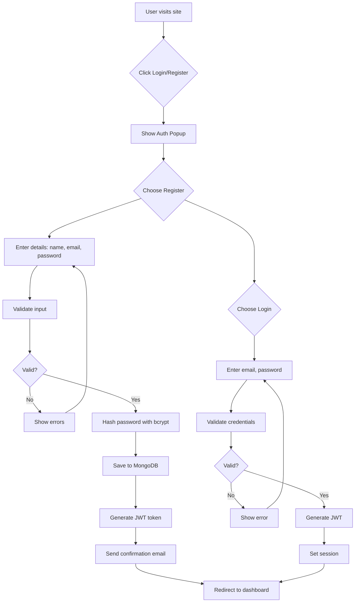
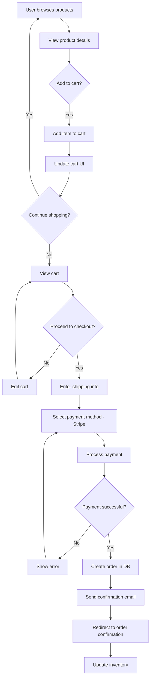
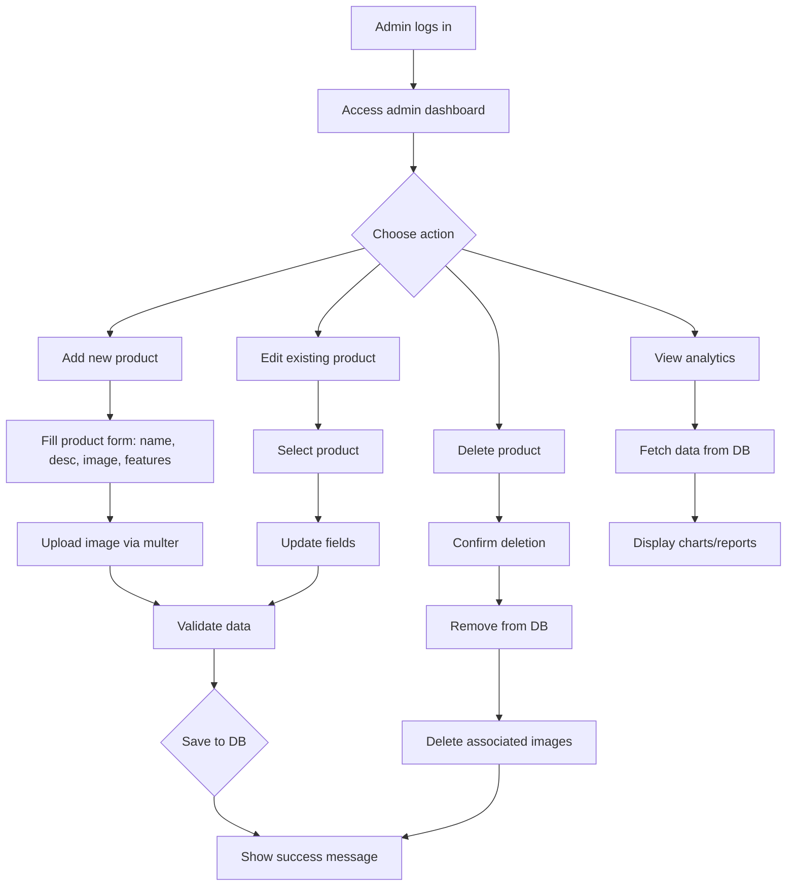
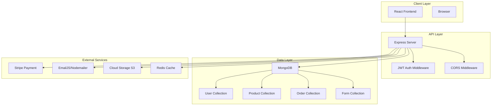
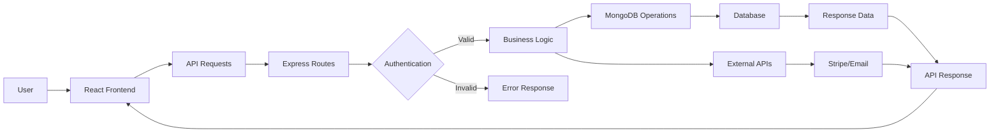
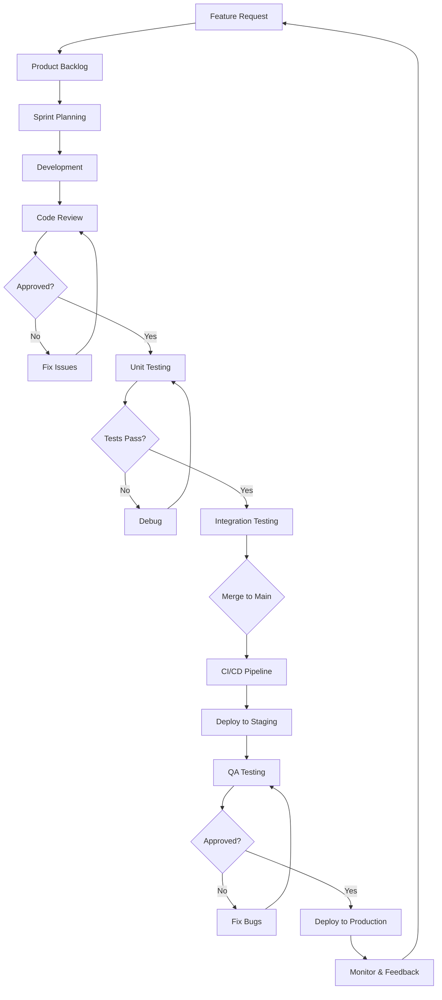
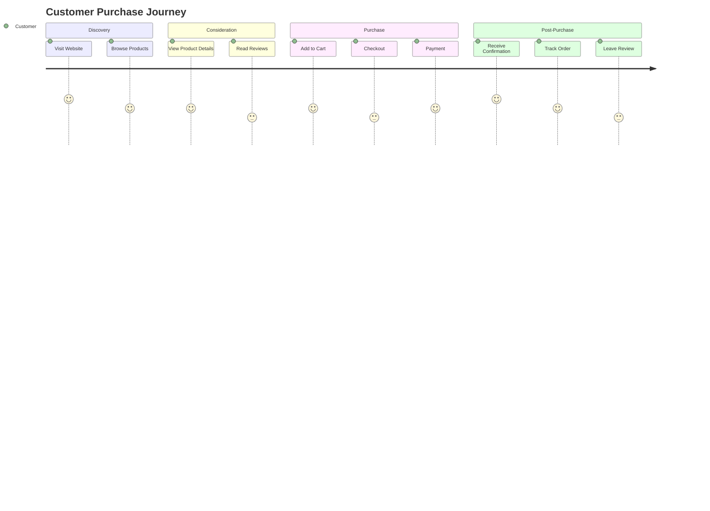

# Software Requirements Specification (SRS)
## Medical Products Website Enhancement

**Document Version:** 1.0  
**Date:** March 10, 2026  
**Prepared by:** AI Assistant  
**Approved by:** Project Stakeholders  

---

## Table of Contents
1. [Introduction](#1-introduction)
   1.1 [Purpose](#11-purpose)
   1.2 [Scope](#12-scope)
   1.3 [Definitions, Acronyms, and Abbreviations](#13-definitions-acronyms-and-abbreviations)
   1.4 [References](#14-references)
   1.5 [Overview](#15-overview)
2. [Overall Description](#2-overall-description)
   2.1 [Product Perspective](#21-product-perspective)
   2.2 [Product Functions](#22-product-functions)
   2.3 [User Characteristics](#23-user-characteristics)
   2.4 [Constraints](#24-constraints)
   2.5 [Assumptions and Dependencies](#25-assumptions-and-dependencies)
3. [Specific Requirements](#3-specific-requirements)
   3.1 [External Interface Requirements](#31-external-interface-requirements)
   3.2 [Functional Requirements](#32-functional-requirements)
   3.3 [Performance Requirements](#33-performance-requirements)
   3.4 [Design Constraints](#34-design-constraints)
   3.5 [Software System Attributes](#35-software-system-attributes)
   3.6 [Other Requirements](#36-other-requirements)
4. [Appendices](#4-appendices)

---

## 1. Introduction

### 1.1 Purpose
This Software Requirements Specification (SRS) document describes the functional and non-functional requirements for enhancing the React-Medical-Products web application. The current system is a basic product catalog with admin management capabilities. The enhancement will focus on improving product discovery, admin tools, and overall site usability while keeping the core catalog experience intact.

The document serves as a reference for developers, designers, testers, and stakeholders to understand the system requirements and ensure all parties have a common understanding of the project scope and objectives.

### 1.2 Scope
The scope of this enhancement includes:
- **In Scope:**
  - User registration and authentication system
  - Enhanced product management with categories and reviews
  - Admin dashboard with analytics and content management tools
  - Contact form database storage
  - Newsletter subscription system
  - Mobile-responsive design improvements
  - Improved search, filtering, and browsing experience
  - Accessibility and performance enhancements  
  - Live chat integration


- **Out of Scope:**
  - Shopping cart and order processing features
  

### 1.3 Definitions, Acronyms, and Abbreviations
- **API:** Application Programming Interface
- **CRUD:** Create, Read, Update, Delete
- **JWT:** JSON Web Token
- **PWA:** Progressive Web App
- **SRS:** Software Requirements Specification
- **UI/UX:** User Interface/User Experience
- **WCAG:** Web Content Accessibility Guidelines

### 1.4 References
- [IEEE Standard for Software Requirements Specifications (IEEE 830-1998)](https://ieeexplore.ieee.org/document/720574)
- React Documentation: https://reactjs.org/docs/
- Express.js Documentation: https://expressjs.com/
- MongoDB Documentation: https://docs.mongodb.com/

### 1.5 Overview
The document is organized according to IEEE 830-1998 standard for software requirements specifications. Section 2 provides an overall description of the product. Section 3 details the specific requirements. Section 4 contains appendices with supporting information.

## 2. Overall Description

### 2.1 Product Perspective
The Medical Products Website is a web-based application that will serve as the primary digital presence for a medical products company. It interfaces with:
- **Email Services:** Nodemailer for transactional emails
- **File Storage:** Local file system (to be migrated to cloud storage)
- **Database:** MongoDB for data persistence

The system will replace the current basic catalog system and provide an enhanced product catalog and management experience.

### 2.2 Product Functions
The major functions of the enhanced system include:
1. **User Management:** Registration, authentication, profile management
2. **Product Catalog:** Advanced product browsing, search, and filtering
3. **Admin Management:** Product CRUD, user management, content management
4. **Communication:** Contact forms, newsletter subscriptions
5. **Analytics:** Basic reporting and metrics

### 2.3 User Characteristics
- **Customers:** Healthcare professionals, medical facilities, general users seeking medical products
- **Administrators:** Company staff responsible for product management and order fulfillment
- **Technical Skills:** Vary from basic computer literacy to advanced technical knowledge

### 2.4 Constraints
- **Technical:** Must maintain compatibility with existing MongoDB data
- **Business:** Must comply with healthcare industry regulations
- **Regulatory:** Must adhere to data protection laws (GDPR, HIPAA considerations)
- **Budget:** Development must stay within allocated budget
- **Timeline:** Must be completed within 24 weeks

### 2.5 Assumptions and Dependencies
- **Assumptions:**
  - Existing server infrastructure can handle increased load
  - MongoDB Atlas or similar cloud database service is accessible
  - Development team has required technical expertise

- **Dependencies:**
  - Email providers remain operational
  - Browser compatibility requirements are met
  - Internet connectivity for cloud services

## 3. Specific Requirements

### 3.1 External Interface Requirements

#### 3.1.1 User Interfaces
- **Responsive Design:** Must work on desktop (≥1024px), tablet (768px-1023px), and mobile (<768px) devices
- **Accessibility:** Must comply with WCAG 2.1 AA standards
- **Browser Support:** Chrome, Firefox, Safari, Edge (latest 2 versions)
- **Loading States:** All async operations must show appropriate loading indicators

#### 3.1.2 Hardware Interfaces
- **Server Requirements:** Minimum 2GB RAM, 20GB storage, Linux/Windows OS
- **Database:** MongoDB 5.0+ compatible server
- **File Storage:** 50GB minimum storage for product images

#### 3.1.3 Software Interfaces
- **Frontend-Backend:** RESTful API with JSON data exchange
- **Database:** MongoDB with Mongoose ODM
- **Email:** SMTP or email service provider integration

#### 3.1.4 Communication Interfaces
- **HTTPS:** All data transmission must use SSL/TLS encryption
- **API Rate Limiting:** Maximum 100 requests per minute per IP
- **CORS:** Properly configured for cross-origin requests

### 3.2 Functional Requirements

#### 3.2.1 User Authentication System
**Priority:** High

| Requirement ID | Description | Priority |
|---|---|---|
| FR-AUTH-001 | Users shall be able to register with email, name, and password | High |
| FR-AUTH-002 | Users shall be able to login with email and password | High |
| FR-AUTH-006 | Users shall be able to view and update their profile (name, email, password) | High |
| FR-AUTH-007 | Users shall be able to log out securely | High |
| FR-AUTH-003 | System shall support password reset via email | Medium |
| FR-AUTH-004 | Admin shall have role-based access to management features | High |
| FR-AUTH-005 | JWT tokens shall expire after 24 hours | Medium |

#### 3.2.2 Product Management
**Priority:** High

| Requirement ID | Description | Priority |
|---|---|---|
| FR-PROD-001 | Users shall be able to browse products with pagination | High |
| FR-PROD-002 | Users shall be able to search products by name and description | High |
| FR-PROD-002a | Search shall provide instant suggestions (autocomplete) and handle partial matches | Medium |
| FR-PROD-002b | Search shall support filtering by multiple fields (name, tags, categories, SKU) | Medium |
| FR-PROD-003 | Users shall be able to filter products by category and price | Medium |
| FR-PROD-003a | Product filters shall support multiple selectable facets (category, size, price range, tag, availability) | Medium |
| FR-PROD-003b | Filter results shall update quickly without full page reload (client-side / API paging) | Medium |
| FR-PROD-004 | Admin shall be able to create, read, update, delete products | High |
| FR-PROD-005 | Products shall support multiple images | Medium |
| FR-PROD-006 | Products shall have categories and tags | Medium |
| FR-PROD-007 | Product catalogue shall support sorting (price, newest, popularity) | Medium |

#### 3.2.3 Shopping and Order Management (Out of Scope)
**Priority:** Low

This enhancement does not include shopping cart, checkout, or order management functionality. Those features may be considered in a future phase.

#### 3.2.4 Admin Dashboard
**Priority:** Medium

| Requirement ID | Description | Priority |
|---|---|---|
| FR-ADMIN-001 | Admin shall view sales analytics and metrics | Medium |
| FR-ADMIN-001a | Admin dashboard shall display live traffic stats (active users, page views, top pages) with real-time updates | Medium |
| FR-ADMIN-002 | Admin shall manage user accounts | Medium |
| FR-ADMIN-003 | Admin shall view and respond to contact forms | Medium |
| FR-ADMIN-003a | Contact messages shall be stored in the database and support threaded replies to users via email | Medium |
| FR-ADMIN-003b | Admin shall be able to mark contact messages as resolved and optionally notify users | Medium |
| FR-ADMIN-004 | Admin shall manage newsletter subscriptions | Low |
| FR-ADMIN-005 | Admin shall export data (products, orders, users) | Low |
| FR-ADMIN-006 | Admin shall create and send site-wide notifications (banner alerts, in-app messages) for updates and announcements | Low |
| FR-ADMIN-007 | Admin dashboard shall allow toggling dark mode for the admin interface | Low |

### 3.3 Performance Requirements

| Requirement ID | Description | Value |
|---|---|---|
| PR-PERF-001 | Page load time | < 3 seconds |
| PR-PERF-002 | API response time | < 500ms for 95% of requests |
| PR-PERF-003 | Concurrent users | Support 1000+ simultaneous users |
| PR-PERF-004 | Database query time | < 100ms average |
| PR-PERF-005 | Image loading | < 2 seconds for product images |
| PR-PERF-006 | Search response | < 1 second for product search |

### 3.4 Design Constraints

#### 3.4.1 Software Design Constraints
- **Architecture:** Maintain separation between frontend and backend
- **Database:** Use MongoDB with Mongoose ODM
- **Authentication:** JWT-based stateless authentication
- **State Management:** Redux Toolkit for complex frontend state

#### 3.4.2 Hardware Design Constraints
- **Server:** Compatible with Node.js 18+
- **Database:** MongoDB 5.0+ compatible
- **Browser:** ES6+ compatible browsers

#### 3.4.3 Other Design Constraints
- **Security:** Implement OWASP security guidelines
- **Scalability:** Design for horizontal scaling
- **Maintainability:** Follow clean code principles

### 3.5 Software System Attributes

#### 3.5.1 Security
- **Authentication:** Secure password hashing with bcrypt
- **Authorization:** Role-based access control
- **Data Protection:** Encrypt sensitive data in transit and at rest
- **Input Validation:** Server-side validation on all inputs
- **Session Management:** Secure JWT token handling

#### 3.5.2 Reliability
- **Availability:** 99.5% uptime target
- **Error Handling:** Graceful error handling with user-friendly messages
- **Data Integrity:** Database transactions for critical operations
- **Backup:** Automated daily backups

#### 3.5.3 Usability
- **Intuitive UI:** Follow established e-commerce UX patterns
- **Accessibility:** WCAG 2.1 AA compliance
- **Mobile-First:** Responsive design for all devices
- **Dark Mode:** Provide a theme toggle (light/dark) with system preference support
- **Performance:** Fast loading and smooth interactions

#### 3.5.4 Portability
- **Cross-Platform:** Compatible with Windows, Linux, macOS servers
- **Browser Compatibility:** Modern browsers support
- **Deployment:** Docker containerization for easy deployment

#### 3.5.5 Maintainability
- **Code Quality:** ESLint configuration and code standards
- **Documentation:** Inline comments and API documentation
- **Modular Design:** Component-based architecture
- **Testing:** Comprehensive test coverage

### 3.6 Other Requirements

#### 3.6.1 Legal Requirements
- **Data Protection:** GDPR compliance for EU users
- **Healthcare Compliance:** Consider HIPAA requirements for medical data
- **Terms of Service:** User agreement and privacy policy
- **Cookie Policy:** Cookie consent management

#### 3.6.2 Ethical Requirements
- **Data Privacy:** Transparent data collection and usage
- **Fair Pricing:** Clear pricing without hidden fees
- **Accessibility:** Inclusive design for users with disabilities

## 4. Appendices

### Appendix A: Use Cases

#### Use Case 1: Customer Registration
**Actor:** Customer  
**Preconditions:** User is on registration page  
**Main Flow:**
1. User enters name, email, password
2. System validates input
3. System creates user account
4. System sends confirmation email
5. User is redirected to login page

#### Use Case 2: User Profile Management
**Actor:** Customer  
**Preconditions:** User is logged in  
**Main Flow:**
1. User navigates to profile page
2. System displays current profile information
3. User updates profile fields (name, email, password)
4. System validates changes and saves updates
5. User receives confirmation of changes

#### Use Case 3: Product Browsing
**Actor:** Customer  
**Preconditions:** User is on the product catalog page  
**Main Flow:**
1. User searches or filters products
2. System displays matching products
3. User views product details and images
4. User saves favorites or shares product links

#### Use Case 4: Admin Product Management
**Actor:** Administrator  
**Preconditions:** Admin is logged in  
**Main Flow:**
1. Admin navigates to product management
2. Admin selects "Add Product"
3. Admin fills product details and uploads images
4. System validates and saves product
5. Admin receives success confirmation

### Appendix B: User Stories

#### Epic: User Authentication
- As a customer, I want to register an account so I can access personalized features
- As a customer, I want to login securely so I can access my account
- As a customer, I want to view and update my profile so I can keep my information up to date
- As a user, I want to reset my password so I can regain access if forgotten
- As an admin, I want role-based access so I can manage the system

#### Epic: Product Management
- As a customer, I want to browse products so I can find what I need
- As a customer, I want to search products so I can quickly find specific items
- As an admin, I want to add products so I can expand the catalog
- As an admin, I want to edit products so I can update information

#### Epic: Site Interaction
- As a customer, I want to browse products so I can find what I need
- As a customer, I want to save favorite products for later
- As a customer, I want to contact the company so I can ask questions
- As an admin, I want to respond to inquiries so I can support users

### Appendix C: Acceptance Criteria

#### Feature: User Registration
**Given** a new user visits the registration page  
**When** they enter valid information and submit  
**Then** an account is created and confirmation email is sent  

**Given** a user enters invalid information  
**When** they submit the form  
**Then** appropriate error messages are displayed  

#### Feature: Product Search
**Given** products exist in the catalog  
**When** a user searches for a term  
**Then** relevant products are displayed within 1 second  

**Given** a user applies filters  
**When** they select category and price range  
**Then** only matching products are shown  

### Appendix D: Database Schema

#### User Collection
```javascript
{
  _id: ObjectId,
  name: String (required),
  email: String (required, unique),
  password: String (required, hashed),
  role: String (enum: ['customer', 'admin'], default: 'customer'),
  address: {
    street: String,
    city: String,
    state: String,
    zipCode: String,
    country: String
  },
  createdAt: Date,
  updatedAt: Date
}
```

#### Product Collection
```javascript
{
  _id: ObjectId,
  name: String (required),
  description: String,
  price: Number (required),
  category: String,
  images: [String], // Array of image URLs
  stock: Number (default: 0),
  features: [String],
  tags: [String],
  isActive: Boolean (default: true),
  createdAt: Date,
  updatedAt: Date
}
```

#### Order Collection
```javascript
{
  _id: ObjectId,
  userId: ObjectId (ref: 'User'),
  items: [{
    productId: ObjectId (ref: 'Product'),
    quantity: Number,
    price: Number
  }],
  total: Number,
  status: String (enum: ['pending', 'processing', 'shipped', 'delivered', 'cancelled']),
  shippingAddress: Object,
  paymentId: String, // Stripe payment intent ID
  createdAt: Date,
  updatedAt: Date
}
```

### Appendix E: API Endpoints

| Method | Endpoint | Description | Authentication |
|--------|----------|-------------|----------------|
| POST | /api/auth/register | User registration | None |
| POST | /api/auth/login | User login | None |
| GET | /api/auth/me | Get current user | JWT |
| GET | /api/products | Get all products | None |
| POST | /api/products | Create product | Admin JWT |
| GET | /api/products/:id | Get product by ID | None |
| PUT | /api/products/:id | Update product | Admin JWT |
| DELETE | /api/products/:id | Delete product | Admin JWT |
| GET | /api/products/search | Search products | None |
| POST | /api/cart | Add to cart | JWT |
| GET | /api/cart | Get cart items | JWT |
| POST | /api/orders | Create order | JWT |
| GET | /api/orders | Get user orders | JWT |
| GET | /api/orders/:id | Get order details | JWT |
| PUT | /api/orders/:id/status | Update order status | Admin JWT |

### Appendix F: Testing Requirements

#### Unit Testing
- All utility functions must have unit tests
- API controllers must have unit tests
- React components must have unit tests
- Minimum 80% code coverage required

#### Integration Testing
- API endpoints must be tested with Supertest
- Database operations must be tested
- Payment flow integration must be tested

#### End-to-End Testing
- Critical user journeys must be tested
- Cross-browser compatibility must be verified
- Mobile responsiveness must be tested

#### Performance Testing
- Load testing with 1000 concurrent users
- API response time validation
- Memory leak detection

### Appendix G: Deployment Requirements

#### Environment Setup
- **Development:** Local development environment
- **Staging:** Pre-production testing environment
- **Production:** Live environment with monitoring

#### Infrastructure Requirements
- **Web Server:** Node.js application server
- **Database:** MongoDB cluster
- **File Storage:** Cloud storage (AWS S3)
- **CDN:** For static assets
- **Monitoring:** Application performance monitoring
- **Backup:** Automated database backups

#### Security Requirements
- **SSL/TLS:** HTTPS encryption for all traffic
- **Firewall:** Web application firewall
- **DDoS Protection:** Rate limiting and DDoS mitigation
- **Data Encryption:** Database encryption at rest
- **Access Control:** Least privilege principle

---

### Appendix H: Potential Enhancements (Optional)
These enhancements are not in the current scope but can add value once the core features are stable.

- **Wishlist / Favorites:** Allow users to save products for later
- **Multi-language Support:** Support multiple locales (e.g., English, Urdu)
- **Multi-currency Pricing:** Display prices in different currencies based on location
- **Real-time Chat / Support:** Integrate chat support (e.g., Intercom, live chat widget)
- **Recommendations:** Personalized product suggestions based on browsing or purchase history
- **SEO Enhancements:** Improve meta tags, structured data, sitemap generation
- **PWA Features:** Add offline support, installable app experience

---

**Document Approval:**

| Role | Name | Signature | Date |
|------|------|-----------|------|
| Project Manager | | | |
| Lead Developer | | | |
| QA Lead | | | |
| Product Owner | | | |

**Change History:**

| Version | Date | Author | Description |
|---------|------|--------|-------------|
| 1.0 | March 10, 2026 | AI Assistant | Initial release |

### 2.1 Existing Features
- **Frontend (React):**
  - Static pages: Home, About Us, Products, Services, Contact Us, Custom Manufacturing, Standard Compliance, Global Export, Logistic Management, Market Compliance, Exhibition Program, Distributor Collaboration
  - Product catalog: List view and detailed view with images, descriptions, features, sizes
  - Admin panel: Dashboard and product CRUD interface with image upload
  - Contact form: Collects user inquiries and sends via email
  - Authentication: Hardcoded admin login only
  - Protected routes for admin areas
  - Page transitions and loading screens
  - Responsive design with CSS

- **Backend (Node.js/Express):**
  - Admin authentication: JWT-based login for hardcoded admin credentials
  - Product management API: Full CRUD operations (GET, POST, PUT, DELETE) with search functionality
  - Contact form API: Receives form data and sends HTML-formatted emails via Nodemailer
  - File upload API: Handles image uploads for products using Multer
  - Static file serving: Serves uploaded product images
  - MongoDB integration with connection handling
  - CORS enabled for cross-origin requests
  - Production setup: Serves React build files in production

- **Database Models:**
  - User: Basic model (name, email, password) - currently unused for customer auth
  - Product: name, description, image, size, features array
  - Form: Contact form submissions (name, country, company, phone, email, message, createdAt)

- **API Endpoints:**
  - `/api/auth/login`: Admin login
  - `/api/auth/me`: Get current admin user
  - `/api/products`: CRUD operations for products
  - `/api/products/search`: Search products by name/title
  - `/api/form/submit`: Submit contact form (sends email)
  - `/api/upload`: Upload product images
  - `/api/users`: Get all users (no auth required - admin only)

### 2.2 Technology Stack
- **Frontend:** React 19, React Router DOM 7, Axios (implied), FontAwesome icons, React Toastify
- **Backend:** Node.js, Express 5, MongoDB (Mongoose), JWT, bcryptjs, Multer, Nodemailer, CORS
- **Deployment:** Configured for production static file serving
- **Development:** No testing framework currently, basic setup

### 2.3 Current Limitations
- No customer user registration/authentication
- No shopping cart or e-commerce functionality
- Contact forms only send emails, not stored in database
- No order management or payment processing
- Limited admin features (only product management)
- No search/filtering on frontend
- No user profiles or wishlists
- No analytics or reporting
- No inventory tracking
- Hardcoded admin credentials (security risk)
- No input validation or error handling on many endpoints
- No API documentation
- No testing suite

## 3. Proposed Enhancements

### 3.1 Functional Requirements

#### 3.1.1 User Authentication & Management
- **Customer Registration/Login:** Implement full user auth system using existing User model
- **Password Security:** Use bcryptjs for hashing, add password reset functionality
- **User Profiles:** Allow users to view/edit profile information
- **Session Management:** Persistent login sessions with JWT refresh tokens

#### 3.1.2 E-Commerce Features
- **Shopping Cart:** Implement add-to-cart, view cart, update quantities, remove items (localStorage + backend sync)
- **Order Management:** Create orders, track order status, order history per user
- **Checkout Process:** Integrate with Stripe for secure payments, collect shipping/billing info
- **Inventory Management:** Add stock quantity to Product model, track inventory, low stock alerts
- **Wishlist:** Allow users to save favorite products

#### 3.1.3 Enhanced Product Features
- **Search & Filtering:** Add frontend search bar and filters (category, price range, features)
- **Product Categories:** Add category field to products, implement category-based browsing
- **Product Reviews & Ratings:** Enable users to leave reviews and star ratings
- **Product Images:** Support multiple images per product, image gallery
- **Price Management:** Add price field to products, support pricing tiers

#### 3.1.4 Contact & Communication
- **Store Contact Forms:** Save form submissions to database in addition to emailing
- **Newsletter Subscription:** Implement newsletter signup with email list management
- **Email Templates:** Create customizable email templates for orders, newsletters
- **Admin Contact Management:** View and manage contact form submissions in admin panel

### 3.2 Non-Functional Requirements

#### 3.2.1 Performance
- **Response Time:** API responses under 500ms for most operations
- **Scalability:** Support up to 10,000 concurrent users
- **Caching:** Implement Redis for session and data caching
- **Image Optimization:** Compress and optimize product images

#### 3.2.2 Security
- **Data Encryption:** Encrypt sensitive data at rest and in transit
- **Input Validation:** Comprehensive validation on all user inputs
- **Rate Limiting:** Implement rate limiting on API endpoints
- **Authentication Enhancements:** Add two-factor authentication (2FA)
- **Audit Logging:** Log all admin actions and sensitive operations

#### 3.2.3 Usability
- **Mobile Responsiveness:** Ensure full mobile compatibility
- **Accessibility:** WCAG 2.1 AA compliance
- **SEO Optimization:** Implement meta tags, sitemaps, structured data
- **Progressive Web App (PWA):** Enable offline functionality

#### 3.2.4 Reliability
- **Error Handling:** Comprehensive error handling and user-friendly error messages
- **Backup and Recovery:** Automated database backups
- **Monitoring:** Implement logging and monitoring (e.g., Winston, PM2)
- **Testing:** Unit tests, integration tests, end-to-end tests (Jest, Cypress)

### 3.3 Technical Requirements

#### 3.3.1 Database Schema Updates
- **User Model:** Add fields for profile info, addresses, order history references
- **Product Model:** Add price, category, stock_quantity, images array, reviews array
- **Order Model:** New model for orders (user_id, items, total, status, shipping_info, payment_id)
- **Review Model:** New model for product reviews (user_id, product_id, rating, comment)
- **Contact Model:** New model to store contact form submissions
- **Newsletter Model:** New model for newsletter subscribers

#### 3.3.2 Backend API Enhancements
- **Authentication APIs:** `/api/auth/register`, `/api/auth/login`, `/api/auth/forgot-password`, `/api/auth/reset-password`
- **User APIs:** `/api/users/profile`, `/api/users/orders`, `/api/users/wishlist`
- **Product APIs:** `/api/products/categories`, `/api/products/:id/reviews`, enhanced search with filters
- **Order APIs:** `/api/orders` (CRUD), `/api/orders/:id/status`
- **Cart APIs:** `/api/cart` (add, update, remove items)
- **Contact APIs:** `/api/contacts` (admin view submissions)
- **Newsletter APIs:** `/api/newsletter/subscribe`, `/api/newsletter/unsubscribe`
- **Upload APIs:** Support multiple images, cloud storage migration

#### 3.3.3 Frontend Enhancements
- **State Management:** Implement Redux Toolkit or Zustand for cart, user auth, orders
- **UI Components:** Add reusable components for forms, modals, product cards
- **Routing:** Add protected routes for authenticated users, nested routes for admin
- **Forms:** Implement React Hook Form with validation for all forms
- **API Integration:** Create centralized API service layer with error handling
- **Offline Support:** Implement service workers for PWA features

#### 3.3.4 Security & Validation
- **Input Validation:** Server-side validation using Joi or express-validator
- **Authentication Middleware:** Protect all sensitive routes
- **Rate Limiting:** Implement rate limiting on auth and form endpoints
- **Data Sanitization:** Sanitize all user inputs to prevent XSS
- **CORS Configuration:** Restrict CORS to specific origins
- **Environment Variables:** Move all secrets to .env files

#### 3.3.5 DevOps & Testing
- **Testing:** Add Jest for unit tests, React Testing Library for components, Supertest for API tests
- **CI/CD:** GitHub Actions for automated testing and deployment
- **Docker:** Containerize application for consistent environments
- **Monitoring:** Add Winston for logging, basic health checks
- **API Documentation:** Generate Swagger docs for all endpoints

## 4. Implementation Plan

### Phase 1: Authentication & User Management (2-3 weeks)
- Update User model with additional fields
- Implement user registration/login APIs
- Create registration/login forms on frontend
- Add password reset functionality
- Implement protected routes for authenticated users
- Update admin auth to use database instead of hardcoded

### Phase 2: Product Catalog Enhancement (2-3 weeks)
- Update Product model (price, category, stock, images array)
- Add category management
- Implement advanced search and filtering on frontend
- Support multiple product images
- Add product reviews and ratings system
- Create Review model and APIs

### Phase 3: Shopping Cart & Checkout (3-4 weeks)
- Implement cart functionality (localStorage + backend sync)
- Create cart APIs and frontend components
- Integrate Stripe payment processing
- Create Order model and management system
- Implement checkout flow with shipping/billing forms
- Add order confirmation and email notifications

### Phase 4: Admin Panel Expansion (2-3 weeks)
- Add user management interface
- Implement order management for admins
- Create analytics dashboard with charts
- Add contact form management
- Implement bulk product operations
- Add content management for static pages

### Phase 5: Advanced Features & Optimization (3-4 weeks)
- Implement wishlist functionality
- Add newsletter subscription system
- Enhance contact forms to save to database
- Add inventory management and alerts
- Implement caching and performance optimizations
- Add comprehensive testing suite
- Set up CI/CD pipeline and Docker

### Phase 6: Deployment & Monitoring (1-2 weeks)
- Configure production environment
- Set up monitoring and logging
- Implement error tracking
- Performance testing and optimization
- Security audit and hardening

## 5. Success Criteria
- **User Registration:** 80% of visitors can successfully register and login
- **E-commerce Conversion:** 15% increase in product inquiries leading to purchases
- **Admin Efficiency:** 50% reduction in time spent on manual product management
- **System Performance:** All pages load under 3 seconds, API responses under 500ms
- **Security:** Zero security vulnerabilities in penetration testing
- **User Satisfaction:** Average user satisfaction score of 4.5/5 in post-implementation survey
- **Code Quality:** 80%+ test coverage, clean code standards maintained

## 6. Code Quality Standards
- **Frontend:** ESLint configuration, consistent component structure, TypeScript migration consideration
- **Backend:** Input validation on all endpoints, proper error handling, consistent API response format
- **Database:** Proper indexing, data relationships, migration scripts
- **Testing:** Unit tests for utilities, integration tests for APIs, E2E tests for critical flows
- **Documentation:** Inline code comments, API documentation, README updates

## 7. Deliverables
- **Source Code:** Complete enhanced application with all features implemented
- **Database Schema:** Updated MongoDB models with relationships
- **API Documentation:** Swagger/OpenAPI specification
- **Test Suite:** Comprehensive test coverage with CI/CD integration
- **Deployment Guide:** Instructions for production deployment
- **User Manual:** Admin guide and user documentation
- **Security Audit Report:** Results of security testing and fixes

## 7. Budget and Resources
- **Development Team:** 3 full-stack developers, 1 UI/UX designer, 1 QA engineer
- **Timeline:** 18-24 weeks total development
- **Tools & Services:** Stripe payment processing, cloud storage (AWS S3), monitoring tools
- **Estimated Cost:** $50,000 - $80,000 depending on team rates and tools

## 8. Risks and Mitigation
- **Technical Debt:** Regular code reviews and refactoring sessions
- **Security Vulnerabilities:** Implement OWASP guidelines, regular security audits
- **Performance Issues:** Load testing at each phase, implement caching early
- **Scope Creep:** Strict requirement prioritization, weekly stakeholder reviews
- **Third-party Dependencies:** Regular dependency updates, monitor for vulnerabilities
- **Data Migration:** Careful planning for existing data during model updates
- **User Adoption:** User testing sessions, intuitive UI design

### 8.1 Customer Persona
- **Name:** Alex Johnson
- **Age:** 35-50
- **Occupation:** Healthcare Professional (Doctor, Nurse, Clinic Manager)
- **Goals:** Quickly find and purchase high-quality medical products, manage orders, get reliable customer support
- **Pain Points:** Complex navigation, lack of product details, slow checkout process
- **Needs:** Intuitive search, detailed product info, secure payments, order tracking

### 8.2 Admin Persona
- **Name:** Sarah Chen
- **Age:** 30-45
- **Occupation:** Company Administrator/Product Manager
- **Goals:** Efficiently manage products, users, and orders; generate reports; update content
- **Pain Points:** Manual data entry, lack of analytics, time-consuming tasks
- **Needs:** Comprehensive dashboard, bulk operations, real-time analytics, automated notifications

### 8.3 Developer Persona
- **Name:** Mike Rodriguez
- **Age:** 25-35
- **Occupation:** Full-Stack Developer
- **Goals:** Maintain scalable, secure code; implement new features efficiently
- **Pain Points:** Legacy code issues, lack of testing, deployment challenges
- **Needs:** Clean architecture, automated testing, CI/CD pipeline, documentation

## 9. Workflows

### 9.1 User Registration and Authentication Flow


### 9.2 Product Purchase Flow


### 9.3 Admin Product Management Workflow


## 10. Charts and Diagrams

### 10.1 System Architecture Diagram


### 10.2 Data Flow Diagram


### 10.3 Development Workflow Diagram


### 10.4 User Journey Map (Simplified)


This document will be updated as the project evolves and new requirements are identified.
